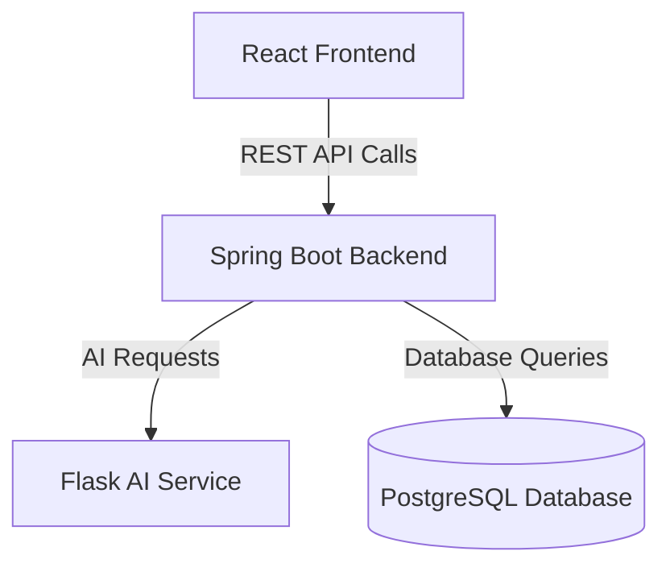

# AI Study Assistant - Spring Boot Backend

## Project Overview
The AI Study Assistant web application is designed to help students
throughout their learning journey. It provides a faster and more efficient way to
study large amounts of text. Users can upload study materials in multiple
formats, including PDF, DOCX and TXT. The system processes these notes through a custom
multi-task AI model built on the T5 transformer, trained to generate concise summaries and
high-quality multiple-choice questions (MCQ) from educational materials. Users can then view the generated summaries,
take quizzes for each uploaded document and review their answers and scores. Based on their results, the system highlights the areas where users
need to focus the most and identifies topics where they may need additional practice.

---

## Table of Contents
- [Project Overview](#project-overview)
- [Features](#features)
- [System Architecture (Diagram)](#system-architecture-diagram)
- [Authentication Flow](#authentication-flow)
- [Backend Workflow](#backend-workflow)
- [Tech Stack](#tech-stack)
- [Project Structure](#project-structure)
- [Setup Instructions](#setup-instructions)
  - [Prerequisites](#prerequisites)
  - [Installation](#installation)
  - [Configuration](#configuration)
  - [Run the Application](#run-the-application)
  - [Notes](#notes)
- [API Documentation](#api-documentation)
- [Related Repositories](#related-repositories)
- [Author](#author)

---

## Features

- **Secure JWT-based Authentication**  
  User sessions are managed using JSON Web Tokens. Access and refresh tokens are stored in HttpOnly cookies.

- **User Registration and Login with OTP Verification**  
  An OTP (One-Time Password) is sent to the user’s email during registration or password reset to verify their account.

- **Upload and manage study materials**  
  Authenticated users can upload study materials in the supported formats and delete existing ones.

- **Automatic summary and quiz generation**  
  The backend connects to a Flask API that hosts a custom-trained T5 transformer model to automatically generate summaries and quizzes.

- **Search and filter notes and quizzes**  
  Users can access and search through all uploaded notes and generated quizzes with the help of pagination and sorting.

- **Track quiz performance and result**  
  Users can review their answers, see scores and monitor progress over time.

---

## System Architecture (Diagram)

The backend is built with **Spring Boot** and serves as the central logic layer of the system. It communicates with
the **Flask AI API** for AI-powered text processing and connects to the **PostgreSQL** database for data storage.
The frontend also interacts with this backend through REST APIs.



---

### Authentication Flow

- Authentication is implemented using JWT tokens stored in HttpOnly cookies.  
- Access tokens are short-lived (10 minutes) and then can expire.  
- Refresh tokens are persisted in the database and used to generate new access tokens.  
- During registration or password reset, an OTP (One-Time Password) is sent to the user’s email.  
- Logout operations invalidate the refresh token in the database.

---

### Backend Workflow

- The backend communicates with a Flask AI API for text processing.  
- Uploaded materials are sent to the API for analysis.  
- The API runs a fine-tuned T5 model for summarization and MCQ generation.  
- It produces concise summaries and high-quality quizzes. 
- Results are returned to the Spring Boot backend and stored in PostgreSQL.

---

### Tech Stack

- **Language**: Java 17
- **Framework**: Spring Boot 3.2.5
- **Database:** PostgreSQL 17 (Dockerized)
- **Authentication:** Spring Security with JWT & Cookies
- **AI Evaluation:** Flask API microservice (Python)
- **Email Service:** Spring Boot Mail
- **API Documentation:** Springdoc OpenAPI 2.5.0
- **Caching:** Caffeine 3.1.8
- **Object Mapping:** ModelMapper 3.2.0
- **Build Tool:** Maven

---

### Project Structure
```
src/
├── main/
│   ├── java/com/aistudyassistant/backend/AI_Study_Assistant_Backend/
│   │   ├── configuration/
│   │   ├── constants/
│   │   ├── controller/
│   │   ├── dtos/
│   │   ├── entities/
│   │   ├── exceptions/
│   │   ├── mappers/
│   │   ├── repository/
│   │   ├── security/
│   │   ├── service/
│   │   ├── utils/
│   │   └── AiStudyAssistantBackendApplication.java
│   └── resources/
│       ├── application.properties
├── test/
└── uploads/
```

---

## Setup Instructions

### Prerequisites
- **Java 17+** installed
- **Maven** installed
- **Docker Desktop** running (for PostgreSQL)
- An IDE like IntelliJ IDEA

### Installation
1. Clone the repository
```bash
git clone https://github.com/KlajdiBajo/AI-Study-Assistant-Backend.git
cd AI-Study-Assistant-Backend
```
2. **Start PostgreSQL in Docker**
```bash
docker-compose up -d
```

### Configuration
**1. Environmental Variables**  
You must configure the following environment variables in your IDE before running the application.
In IntelliJ IDEA, this can be done by navigating to Run → Edit Configurations → Environment Variables.
```
POSTGRES_DB=your_database_name
POSTGRES_USER=your_postgres_username
POSTGRES_PASSWORD=your_postgres_password

SPRING_DATASOURCE_URL=jdbc:postgresql://localhost:your_port/your_database_name?useUnicode=true&characterEncoding=UTF-8&stringtype=unspecified
SPRING_DATASOURCE_USERNAME=your_postgres_username
SPRING_DATASOURCE_PASSWORD=your_postgres_password
SPRING_MAIL_USERNAME=your-email@gmail.com
SPRING_MAIL_PASSWORD=your-app-password
```
**2. Application Properties**  
Your Spring Boot configuration file should look like this:
**`src/main/resources/application.properties`**
```properties
// spring.config.import=optional:file:.env (Optional)

spring.datasource.url=${SPRING_DATASOURCE_URL}
spring.datasource.username=${SPRING_DATASOURCE_USERNAME}
spring.datasource.password=${SPRING_DATASOURCE_PASSWORD}
spring.datasource.driver-class-name=org.postgresql.Driver

spring.jpa.database-platform=org.hibernate.dialect.PostgreSQLDialect
spring.jpa.hibernate.ddl-auto=update

# Extra UTF-8 related safety
spring.jpa.properties.hibernate.connection.useUnicode=true
spring.jpa.properties.hibernate.connection.characterEncoding=UTF-8
spring.jpa.properties.hibernate.jdbc.lob.non_contextual_creation=true

# Server Port (change if needed)
server.port=8080

# File upload limits (adjust as needed)
spring.servlet.multipart.max-file-size=50MB
spring.servlet.multipart.max-request-size=50MB

# Mail Configuration
spring.mail.host=smtp.gmail.com
spring.mail.port=587
spring.mail.username=${SPRING_MAIL_USERNAME}
spring.mail.password=${SPRING_MAIL_PASSWORD}
spring.mail.properties.mail.smtp.auth=true
spring.mail.properties.mail.smtp.starttls.enable=true
```

### Run the Application
1. **Build the project**
```bash
./mvnw clean install
```
2. **Run the backend**
```bash
./mvnw spring-boot:run
```
The backend should now be running at: **`http://localhost:8080`**

### Notes
* The `.env` file is **not included in the repository** for security reasons.  
* Each user must define their own environment variables as shown above.  
* Docker automatically reads variables from `.env` when running `docker-compose up -d`.  
* Spring Boot reads variables using `spring.config.import=optional:file:.env` if present, or directly from the environment.

---

### API Documentation
Once the application is running, you can access all the APIs at:
```bash
http://localhost:8080/swagger-ui.html
```

---

### Related Repositories
- **Flask API (AI Service):** [AI-Study-Assistant-FlaskAPI](https://github.com/yourusername/AI-Study-Assistant-Flask)  

- **React Frontend (User Interface):** [AI-Study-Assistant-Frontend](https://github.com/yourusername/AI-Study-Assistant-Frontend)

---

### Author
Developed By [KlajdiBajo](https://github.com/KlajdiBajo)
